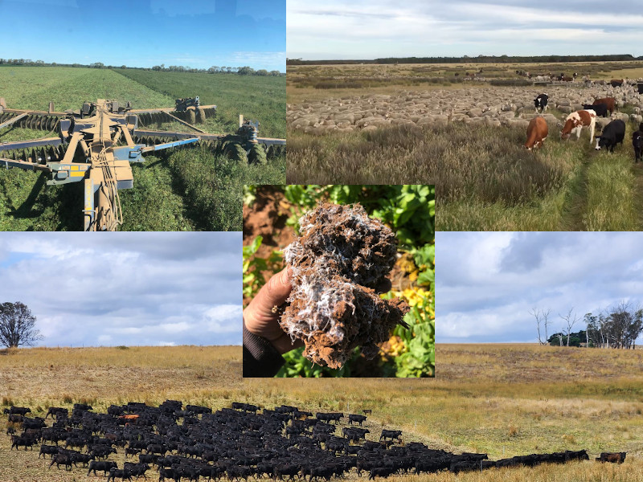
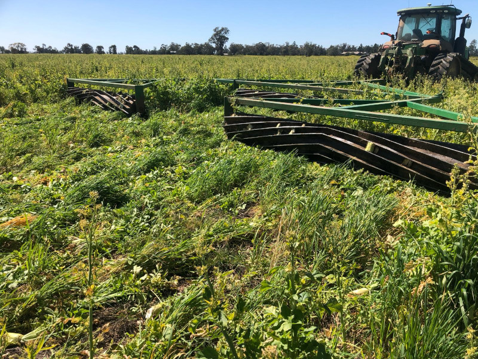

# Welcome to the Regenerative Agriculture Community

Since November 2023, several regenerative farmers have come together and begun growing the roots of a new online community. We share together and support each other as we farm.

## We are regenerative practitioners

We are regenerative farmers and gardeners seeking to collaborate with our peers across the world.

We are also students, teachers, landscapers, researchers, artists, media creators, engineers, ... who regenerate or support regeneration through our work, and share a passion in regenerative agriculture.

Learn more about us, see:

- [more about our community](more.md)
- [more about what brings us together](regenerative-agriculture.md)

## Find fellowship on your regenerative journey 💞

Whether you're a seasoned farmer or just starting out, our community is a collaborative place to connect with peers and grow together.

## 🌍 Be a part of the change! 🌏

If we share with each other as we work on our fields and gardens, we can&hellip;

- Increase our chances of our mutual success and prosperity.
- Increase the healing that regenerative agriculture has on our planet, our local communities, and ourselves.
- Develop fulfilling relationships as we connect on restoring life through the way we choose to farm.

## We hope to meet you soon

Let’s grow together and make a difference! We welcome you to come connect with us, exchange ideas, ask & discuss questions, and contribute to community projects.

[Come check out our community][Join]{ target="_blank" .md-button .md-button--primary .center }

[Join]: https://discord.com/invite/DNH834xXZg
